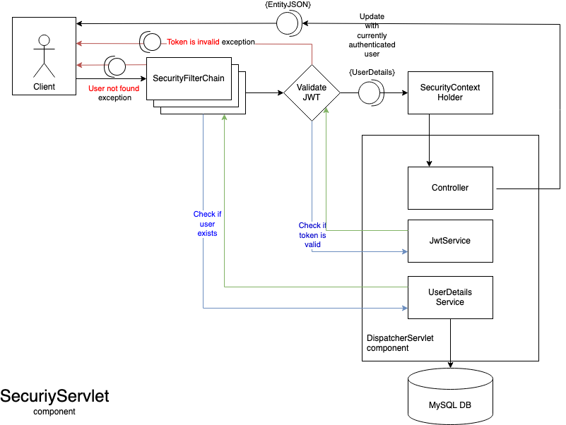

# StackUnderflow

## Descrierea proiectului 

Platforma StackUnderflow permite utilizatorilor să își creeze un cont și să se autentifice pentru a putea să adauge și să răspundă la întrebări. Acești pot sugera modificări/îmbunătățiri la comentariile deja postate. În plus, utilizatorul care a postat întrebarea poate să aleagă cel mai bun răspuns. Adăugarea de răspunsuri, întrebări și alegerea răspunsului ca fiind cel mai potrivit va aduce puncte utilizatorului, puncte care duc la obținerea de badge-uri. Întrebările postate de utilizator pot fi împărțite pe topic-uri. De asemenea, un utilizator poate da like/dislike la comentariile adăugate de alți utilizatori. Pentru comentarii se poate vedea un istoric ce conține toate editările și sugestiile acestora. 

## Tehnologii

Partea de backend a proiectului a fost implementată folosind limbajul de programare Java, partea de frontend a fost realizată în Angular, iar pentru baza de date am folosit MySql. 

## Diagrama bazei de date

## Diagrame UML

O centralizare a diagramelor din cadrul echipei, cât și contribuția fiecărui membru se pot găsi în tabelul de mai jos:

DE ADAUGAT POZA

### 1. Diagrama generală (USE CASE)

Pentru a pune în evidență funcționalitățile și cerințele aplicației, am conturat cazurile de utilizare prin intermediul diagramei de use case de mai jos. În diagramă, sunt definite interacțiunile dintre utilizatorii cu rol de vizitator/user și platforma implementată. 

### 2. Diagrama de clasă
Fiecare clasă este reprezentată printr-un grafic cu 3 secțiuni verticale: numele clasei, atributele și operațiile. Atributele și operatiile ce au în față simbolul + sunt publice, iar cele ce au - sunt private. 

De exemplu, clasa cu numele Topic are două atribute private: un id de tip Long și un nume de tip String. De asemenea, are și două operații publice: saveTopic care primește ca parametru un Topic și returnează un mesaj de succes/eroare și operația getAllTopics care nu are parametrii și returnează o listă cu toate topicurile.

Relațiile dintre clase sunt de asociere și agregare. Între clasele Badge și User este o relație de asociere deoarece "Userul are Badge-uri" de cardinalitate 0..* și 0..* pentru că utilizatorul poate avea 0 sau mai multe badge-uri, iar fiecare badge poate fi asociat mai multor utilizatori sau niciunuia. În schimb între clasele Post și Comment este o relație de agregare deoarece "Postarea deține comentarii". Fiecare comentariu este dependent de postarea sa, de aceea cardinalitatea este 1, iar fiecare postare poate avea 0 sau mai multe comentarii (cardinalitate 0..*).

 

### 3. Diagrama de pachete
Pachetele oferă o modalitate de a grupa elemente și ajută la stabilirea dependențelor dintre componentele aplicației. O relație de tip *Access* într-o astfel de diagramă indică utilizarea elementelor precum clase, interfețe dintr-un pachet sau dependența directă de elemente dintr-un alt pachet. O relație de tip *Import* într-o astfel de diagramă sugerează că elementele dintr-un pachet se bazează pe tipuri (clase, interfețe etc.) definite într-un alt pachet fără utilizare directă sau dependență de funcționalitățile lor. De exemplu, în diagrama de mai jos, întrebările depind de răspunsuri, iar această dependență ar putea fi considerată o formă de *Access*, deoarece întrebările se bazează pe elementele oferite de răspunsuri.

Diagrama de pachete de mai jos surprinde interacțiunea și dependența dintre pachetele de pe partea de backend. Serviciile, repositories, DTO-urile, modelele, excepțiile sunt importate în clasele specifice. De exemplu, controller-ul de întrebări importă DTO-ul întrebării și depinde de serviciul unde se află metodele care ajută la gestionarea întrebărilor. 

### 4. Diagrama de deployment

Diagrama de deployment surprinde componentele aplicației și legăturile dintre acestea. Componentele pot fi lansate pe același dispozitiv sau pe mai multe, dacă traficul este permis în rețea.

### 5. Diagrama Use Case (Contract API)

O variantă detaliată a diagramei Use Case se poate vedea [aici](https://github.com/AdrianaDobre/StackUnderflow/blob/main/diagrams/Use%20Case%20Diagram%20(API%20Contract).pdf) 

### 6. Diagrama de activitate pentru gestionarea adăugării de sugestii

Diagrama de activitate surprinde fluxul adăugării de sugestii. Utilizatorul adaugă o sugestie, iar mai apoi prin nodurile de decizie sunt reprenzentate cele două flow-uri: sugestia este acceptată de utilizatorul care a adăugat comentariul inițial sau este refuzată. Acceptarea sugestiei duce la schimbarea comentariului inițial și creșterea numărului de puncte a utilizatorului, actiunți pe care le-am indicat cu ajutorul nodului de join. 

### 7. Diagramă de secvență

### 8. Diagrama de stare pentru editarea unui comentariu

Această diagramă surprinde stările și evenimentele prin care aplicația trece în momentul în care un utilizator dorește să editeze un comentariu.

### 9. Diagrama de componente pentru autentificare

Component diagram for the auth flow, depicting most Spring provided components required for validating a JWT Token, creating the AuthToken and putting the AuthToken in the context of the request.

## Design Patterns

* #### Repository Pattern

Am folosit repositories pentru accesarea contextului bazei de date, deoarece oferă o mai bună menținere și decuplare a infrastructurii. Ele separă stratul logic de date de restul straturilor și ajută la scrierea unui proiect curat și lizibil. Am utilizat Spring Data care permite generarea repositories pentru entitățile din baza de date. Acestea pot genera cele mai comune operațiuni de creare, citire, actualizare și ștergere (CRUD) și interogări personalizate. Un exemplu se poate observa în imaginea de mai jos.

* #### Data Transfer Object Pattern
  
DTO este un design pattern bine-cunoscut și adesea folosit. Un DTO este o clasă Java simplă care ajută la rafinarea unui obiect pentru a fi transferat în cel mai eficient și sigur mod din backend către client (în cazul nostru frontend). Totodată, ajută la minimizarea dependințelor. 

* #### Client Server Pattern
  
Modelul client-server este o arhitectură de calcul distribuită care împarte aplicațiile software în două roluri distincte: client și server. Acest model arhitectural permite separarea preocupărilor între interfața cu utilizatorul (client) și procesarea sau stocarea datelor (server). Modelul client-server este o structură care distribuie sarcini între furnizorii de resurse sau servicii numite servere și elementele care solicită resurse sau servicii, numite clienți.

